# Projet Arduino

Le projet est basé sur une Arduino R4 Wifi utilisant des capteurs de santé, autres capteurs et actionneurs dans le but de récolter et d’utiliser des données. Ces données, ainsi que l’interaction entre les différents capteurs,seront en finalité utilisées dans le cadre du Home Trainer, un projet de vélo connecté ludique qui sera mis à disposition pour les étudiants d’ISIS.

Au-delà de notre arduino, notre projet utilise comme capteurs un lecteur de carte RFID, un gyroscope et un capteur cardiaque ou électrocardiogramme (ECG). Nous avons également deux LED, une rouge et une verte. Tous ces éléments sont connectés à une breadboard, un prototype de circuit électronique réutilisable permettant de connecter plusieurs éléments entre eux. Petite particularité dans notre cas: un élastique maintient le arduino sur la breadboard afin de pouvoir utiliser plus facilement le gyroscope.


Voici à quoi ressemble le circuit une fois câblé :

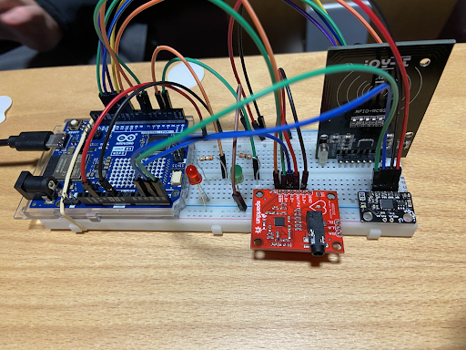

## Aperçu du projet

Le concept de notre projet est de simuler un système d’authentification permettant ensuite de démarrer les autres capteurs de notre montage. Ainsi, en démarrant le arduino, la LED rouge s’allume et, au départ, rien ne se passe. Notre projet démarre lorsque le capteur RFID détecte une puce RFID (présente sur de nombreuses cartes comme les cartes bancaires, cartes étudiantes, etc.), ce qui va enclencher l’utilisation des autres capteurs. Pour montrer que la puce a bien été détectée, la LED rouge va s’éteindre tandis que la LED verte s’allume. L’ECG et le gyroscope vont alors publier leurs données sur l’interface utilisateur, sous la forme d’un graphique pour le premier et de plusieurs jauges pour le second. 

Il est aussi possible, à partir de l’interface, de se déconnecter à l’aide d’un bouton. Le projet retourne alors à son état de départ et cesse de publier sur l’interface. 

Ci-contre un diagramme descriptif de notre projet : 

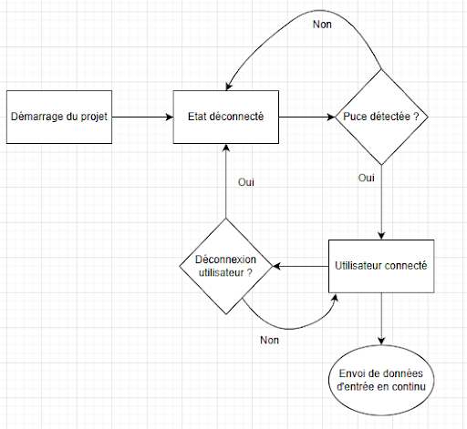

## Prérequis

Pour faire fonctionner le projet, nous utilisons le protocole MQTT couplé à Node-RED. Il s’agit d’un protocole d’échange de données simple d’utilisation qui permet à un client de communiquer directement à un serveur et de lui envoyer des données. Le serveur peut filtrer les messages reçus par topic, des sujets qui cloisonnent les données et séparant leur utilisation. 

Ci-joint un [article clair](https://randomnerdtutorials.com/what-is-mqtt-and-how-it-works/) sur le fonctionnement de MQTT.

Dans notre cas, le client sera notre arduino et le serveur sera le serveur local Node-RED.

Node-RED est une application web légère permettant de créer facilement des flows. Basée sur le protocole MQTT, elle permet d’associer facilement des données d’entrées à des actions. Les flows ainsi créés sont basés sur des nœuds, que la communauté active de Node-RED a contribué à étendre, ce qui donne aujourd’hui une très grande variété d’utilisation à cette application.

Avant d’installer Node-RED, vérifiez que vous avez bien installé Node.js au préalable. Si ce n’est pas le cas, téléchargez et installez [Node.js](https://nodejs.org/fr/download)

L’installation de Node-RED se fait à partir de ce lien : [installation de Node-RED](https://nodered.org/docs/getting-started/windows)

Une fois installé, lancez une invite de commande et entrez la commande node-red pour démarrer l’application. Rendez-vous ensuite sur l’adresse locale donnée dans l’invite de commande pour accéder à votre application.

Pour utiliser notre Arduino, nous utilisons l’extension PlatormIO de l’IDE Visual Studio Code. Celui-ci peut-être trouvé à cette adresse : [Visual Studio Code](https://code.visualstudio.com/)
Il faudra ajouter l’extension “PlatformIO IDE”. Cela nous fournira tous les outils nécessaires pour travailler sur le code Arduino.

Une fois dans l’extension PlatformIO, les librairies à installer pour notre projet sont : 
- knolleary/PubSubClient
- mbed-syundo0730/I2Cdev
- electroniccats/MPU6050
- miguelbalboa/MFRC522

## Composants nécessaires

### Composants principaux 

Le premier composant que nous avons mis en place est le lecteur de puce [RFID-RC522](https://github.com/miguelbalboa/rfid)

C’est un module RFID bon marché qui permet de lire et écrire des cartes ou badges **13,56 MHz**.
Il communique avec l’Arduino via SPI, consomme peu d’énergie et sert surtout pour des projets d’identification, contrôle d’accès ou détection sans contact. Dans notre cas, nous l’utiliserons à des fins d’identification.

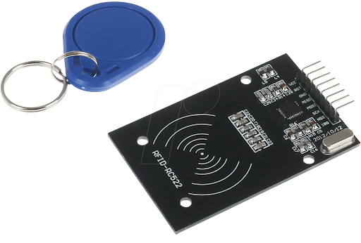

Le gyroscope [MPU6050](https://wiki.dfrobot.com/6_DOF_Sensor-MPU6050__SKU_SEN0142_)

C’est un module combinant un accéléromètre 3 axes et un gyroscope 3 axes dans une seule puce.
Il communique via I2C, mesure mouvements, inclinaisons et rotations, et est très utilisé pour des projets de stabilisation, robots, drones ou détection de gestes, grâce à sa petite taille et sa grande sensibilité. Il nous est d’ailleurs compliqué d’en tirer pour l’instant des résultats satisfaisants compte tenu de cette sensibilité.

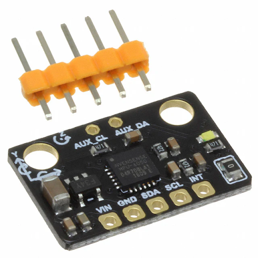

Enfin, le capteur de fréquence cardiaque ou [ECG AD8232](https://learn.sparkfun.com/tutorials/ad8232-heart-rate-monitor-hookup-guide/all)

Le AD8232 est un petit module destiné à mesurer l’activité électrique du cœur afin d’obtenir un signal ECG.
Il amplifie et filtre les faibles signaux issus des électrodes, ce qui le rend pratique pour des projets d’acquisition biomédicale, monitoring simple ou expérimentation pédagogique.

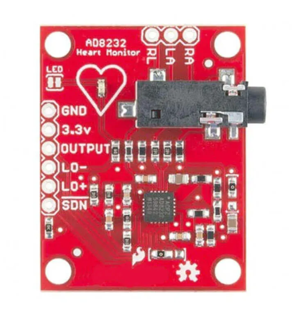

⚠️ Important : ce capteur n’est pas un dispositif médical, il est simplement utilisé dans de petits projets personnels ou scolaires, à notre instar.

### Composants "non capteurs"

En plus de nos capteurs, on retrouve également quelques éléments pour compléter notre projet : 

- 2 résistances de 330 Ohms : 

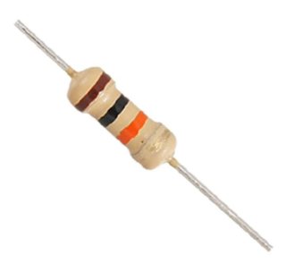

Les résistances connectées aux LEDs servent à limiter le courant qui les traverse.Elles empêchent la LED de consommer trop de courant, ce qui évite sa surchauffe et prolonge sa durée de vie, tout en assurant une luminosité stable.

- 2 leds : une rouge et une verte : 

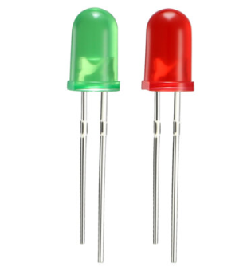

Les leds, elles, sont là pour transmettre à l’utilisateur des informations sur son statut d’identification. Lorsque l’utilisateur est déconnecté, seule la led rouge est allumée. Une fois que l’utilisateur passe son badge, elle s’éteint alors pour laisser place à la led verte qui restera elle allumée jusqu’à qu’il se déconnecte à partir de l’interface Node Red.

- 1 grande breadboard afin de faire tous les branchements entre capteurs et composants autres.

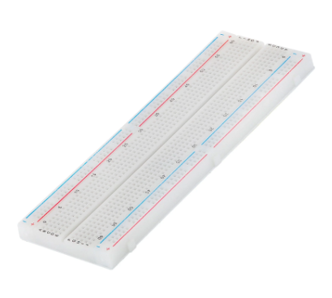

- Une Arduino R4 Wifi, la reine et le cœur de notre projet, qui permet d’alimenter, gérer et surtout sur ce modèle communiquer avec le broker grâce à sa fonction wifi.

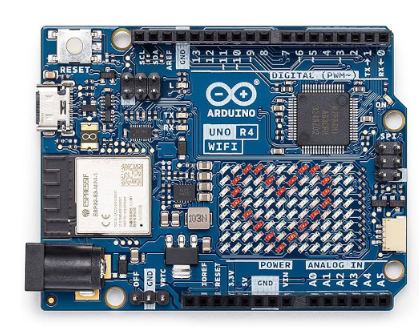

## Fonctionnement du circuit

Nous avons représenté notre montage par le schéma électrique suivant : 

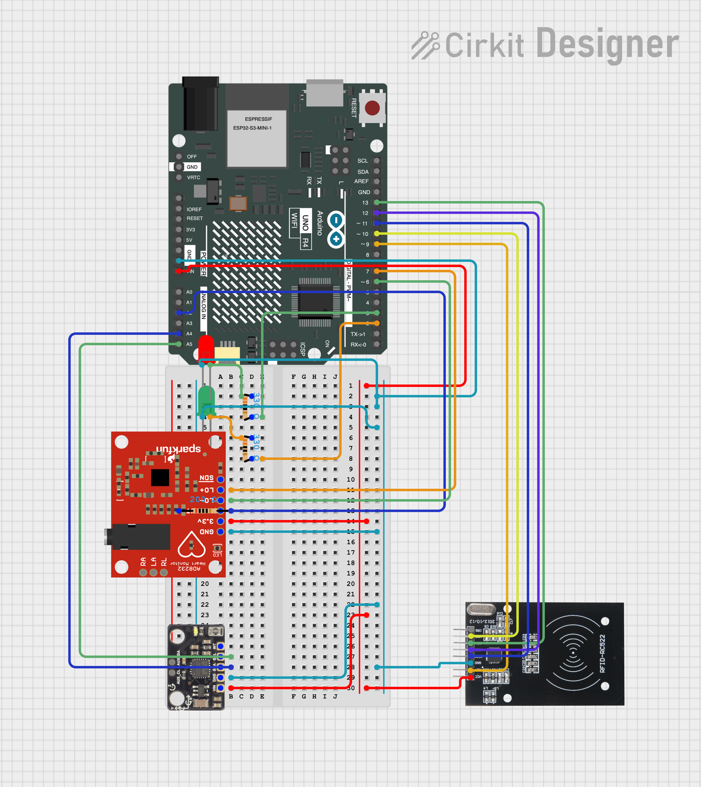

Nos flows Node-RED sont quant à eux très simples, puisque nous n’avons pas énormément de traitement de données. Nous avons au total 6 canaux d’entrée pour le gyroscope (pour l’inclinaison dans 3 axes différents et l’accélération dans ces mêmes 3 axes), 3 canaux pour l’ECG (l’ECG instantané, la moyenne des battements détectés par l’ECG et un debug), et enfin un canal pour le capteur RFID. Enfin, nous avons un canal de sortie lié au bouton de déconnexion de l’utilisateur.

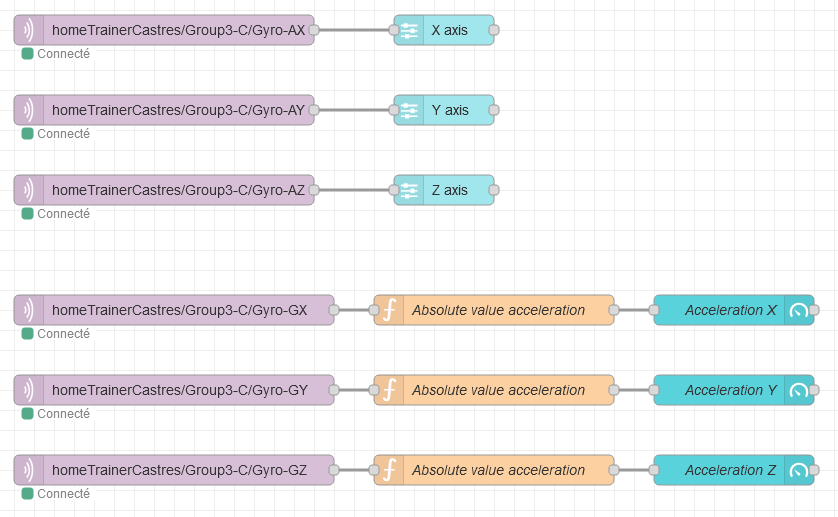
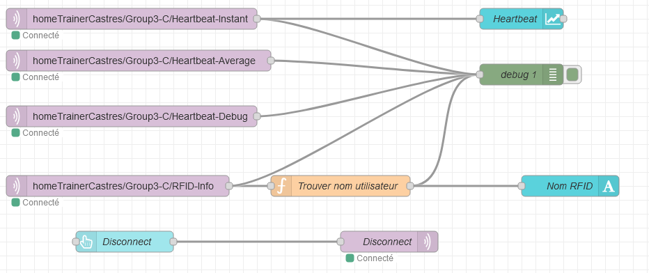

Sur le tableau de bord Node-RED, notre interface comprend : un graphique pour le rythme cardiaque, des jauges pour le gyroscope, et une zone correspondant à l’identification. Lorsqu’un utilisateur est connecté, elle affiche un message de bienvenue et son nom, sinon “Aucun utilisateur connecté”. On retrouve en dessous le bouton de déconnexion.
Nous n’avons malheureusement pas pris de captures d’écran du tableau de bord en état de marche, nous avons une capture d’écran de celui-ci au repos, lorsqu’aucun utilisateur n’est connecté :

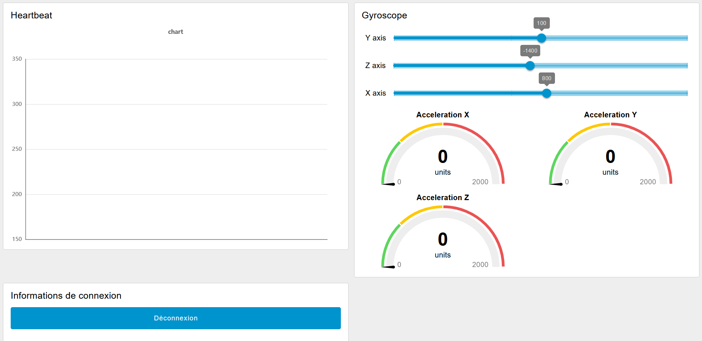

Le code de notre projet se trouve dans le fichier /src/main.cpp. La partie la plus importante du code la fonction loop(), celle qui, en Arduino, s’exécute constamment. Il s’agit entre autre d’un if/else en fonction de la connexion de l’utilisateur, représenté par un booléen. Celui-ci est faux au départ, mais lorsque le capteur RFID détecte une puce, il passe à vrai, ce qui active le reste de la fonction. 

```c++
void loop(){
  if (!mqtt_client.connected())
  {
    connectToMQTTBroker();
  }
  mqtt_client.loop();

  // A chaque loop on vérifie si une carte a été détectée
  if (!cardDetected)
  {
    String messageDeconnexion = "Aucun utilisateur connecté";
    mqtt_client.publish(mqtt_rfid_info, messageDeconnexion.c_str());
    digitalWrite(RED_LED_PIN, HIGH);
    digitalWrite(GREEN_LED_PIN, 0);

    // Si détection d'une nouvelle carte, l'id est publiée et cardDetected devient vraie 
    if (!mfrc522.PICC_IsNewCardPresent())
    {
      return;
    }
    if (!mfrc522.PICC_ReadCardSerial())
    {
      return;
    }
    mfrc522.PICC_DumpToSerial(&(mfrc522.uid));
    unsigned long uid = getID();
    if (uid != 0)
    {
      String uidUser = (String)uid;
      mqtt_client.publish(mqtt_rfid_info, uidUser.c_str());
    }
    cardDetected = true;
  }
  else
  {
    // L'utilisateur est connecté : on lit les données de l'ECG et du gyroscope
    digitalWrite(GREEN_LED_PIN, HIGH);
    digitalWrite(RED_LED_PIN, 0);

    if ((digitalRead(CRD_PLUS_PIN) == 1) || (digitalRead(CRD_MINUS_PIN) == 1))
    {
      Serial.println('!');
    }
    else
    {
      unsigned long currentTime = millis();

      // send the value of analog input 0:
      Serial.println(analogRead(A0));
      if (analogRead(A0) > 0)
      {
        processECG();
      }
      // Message de debug toutes les 10s
      if (currentTime - lastDebugPublishTime >= 10000)
      {
        String debugMsg = "Alive " + String(currentTime / 1000) + "s | ECG BPM: " + String(averageBPM);
        mqtt_client.publish(mqtt_heartbeat_debug, debugMsg.c_str());
        lastDebugPublishTime = currentTime;
      }
    }
    // Wait for a bit to keep serial data from saturating
    delay(1);

    // read raw accel/gyro measurements from device
    accelgyro.getMotion6(&ax, &ay, &az, &gx, &gy, &gz);

    // these methods (and a few others) are also available
    // accelgyro.getAcceleration(&ax, &ay, &az);
    // accelgyro.getRotation(&gx, &gy, &gz);

#ifdef OUTPUT_READABLE_ACCELGYRO
    // display tab-separated accel/gyro x/y/z values
    Serial.print("a/g:\t");
    Serial.print(ax);
    Serial.print("\t");
    Serial.print(ay);
    Serial.print("\t");
    Serial.print(az);
    Serial.print("\t");
    Serial.print(gx);
    Serial.print("\t");
    Serial.print(gy);
    Serial.print("\t");
    Serial.println(gz);
    String message_ax = String(ax);
    String message_ay = String(ay);
    String message_az = String(az);
    String message_gx = String(gx);
    String message_gy = String(gy);
    String message_gz = String(gz);

    // Publication des données du gyroscope sur Node-RED
    mqtt_client.publish(mqtt_gyro_ax, message_ax.c_str());
    mqtt_client.publish(mqtt_gyro_ay, message_ay.c_str());
    mqtt_client.publish(mqtt_gyro_az, message_az.c_str());
    mqtt_client.publish(mqtt_gyro_gx, message_gx.c_str());
    mqtt_client.publish(mqtt_gyro_gy, message_gy.c_str());
    mqtt_client.publish(mqtt_gyro_gz, message_gz.c_str());
#endif

#ifdef OUTPUT_BINARY_ACCELGYRO
    Serial.write((uint8_t)(ax >> 8));
    Serial.write((uint8_t)(ax & 0xFF));
    Serial.write((uint8_t)(ay >> 8));
    Serial.write((uint8_t)(ay & 0xFF));
    Serial.write((uint8_t)(az >> 8));
    Serial.write((uint8_t)(az & 0xFF));
    Serial.write((uint8_t)(gx >> 8));
    Serial.write((uint8_t)(gx & 0xFF));
    Serial.write((uint8_t)(gy >> 8));
    Serial.write((uint8_t)(gy & 0xFF));
    Serial.write((uint8_t)(gz >> 8));
    Serial.write((uint8_t)(gz & 0xFF));
#endif
  }
}
```

Si un callback est reçu par le programme, le booléen redevient faux, ce qui réinitialise notre loop.

```c++
// Callback via Node-RED, comme la seule utilisation du callback est pour la carte RFID, l'utilisateur est déconnecté dès
// qu'un signal est détecté
void mqttCallback(char *topic, byte *payload, unsigned int length)
{
  Serial.println("Déconnexion en cours");
  String messageDeconnexion = "Aucun utilisateur connecté";
  mqtt_client.publish(mqtt_rfid_info, messageDeconnexion.c_str());
  cardDetected = false;
}
```
